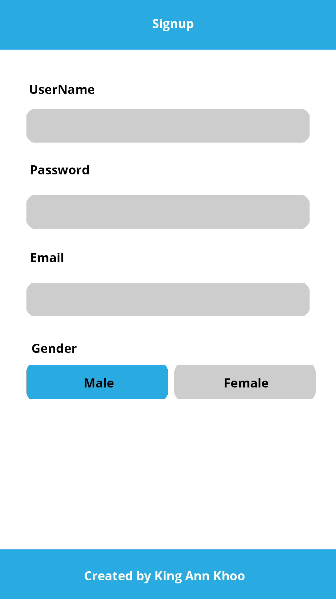

# ToDoApp
<h2>Screenshot</h2>

<h2>Summary of the app</h2>
This app is created to help people keep track of what they need to do. To use the app, users are required to sign up first then login with their account in order to access their tasks. After login, it will display Welcome message to user, option to add new task, "Not Completed" and "Completed" task display list. Users can check the complete button on the task to put them to "Completed" task list. If users want to remove them they can press the X button which will remove the task they choosen.

<h2>Audience</h2>
This app is for people that like to keep tracks of the task they need to do for the daily or any required other needs.

<h2>Experience</h2>
To Do application is simple design and easy to use. Very simple and fastest way to add tasks and also allow quick access to complete or delete task button for user.

<h2>Wireframe/Mockup design</h2>

